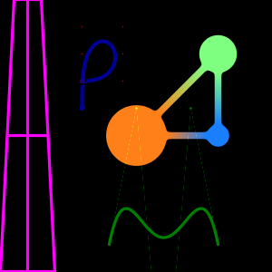
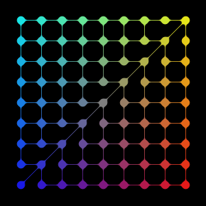

# 2D SDF software renderer
A simple software capable of rendering some 2D geometries, using their Signed Distance Function.
The geometries are defined using a simple instruction format, inspired by WKT notation.

This serve no practical purpose, other than playing with SDF outside of a shader.

| examples/data.wtk | examples/grid.wkt |
| --- | --- |
|  |  |

## Quickstart
Build:
```shell
gcc main.c -lm -O3
```

Run:
```shell
./a.out examples/data.wkt
```
The result is a BMP `canvas.bmp`.
```shell
feh canvas.bmp
```

## Supported geometries and operations
See [examples](./examples/) for intructions file ready to use.

The parsing of the instruction is barebone. It's important to not add any unecessary space or other character.

### Layers
The renderer use layers. Geometries on the same layers interact.
The layers are rendered independently, them additively combined.
| Name | Notations | Description |
| ---- | --------- | ----------- |
| Layer | LAYER(N) | Define a new layer, N indicate the min function to use to blend the geometries: 0 for classic min, 1 for smooth min. |


### Geometries
| Name | Notations | Description |
| ---- | --------- | ----------- |
| Point | POINT(X Y COLOR(R G B A)) | A simple point, the basis for more complex geometries. X and Y are the coordinates in float, with (0 0) being the bottom left corner, and (1 1) the top right corner. Value below/above 0/1 are allowed. COLOR is optional (the default color is magenta), RGBA are float between 0 and 1. |
| Segment | SEGMENT(iA iB) | A segment, defined by 2 points. iA/iB is the index of a Point geom in the layer. The segment take the color of the points. If the points have different color, this produce a gradient. |
| Approximate Bezier curve | BEZIER(iA iB iC ...) | A bezier curve defined by up to MAX_BEZIER_POINT (default 11) points. Same as segment, bezier parameter are points index in the layer. The distance function is approximate (no choice for n-order Bézier curve), this can lead to some artefacts, especialy on self-intersection. These can be reduced by increasing BEZIER_LUT_SIZE. The curve take the color of its first point. |

### Operations
| Name | Notations | Description |
| ---- | --------- | ----------- |
| Round | ROUND(R GEOM...) | Grow a geometry by radius R (value between 0 and 1), making it bigger and rounder. This is used to define the size of point (making it into a circle) and the size of a line. |

## Thanks
- Inigo Quilez for the incredible SDF ressources on [iquilezles.org](https://iquilezles.org).
- Pomax for the approximate Bézier projection [pomax.github.io/bezierinfo/#projections](https://pomax.github.io/bezierinfo/#projections).
